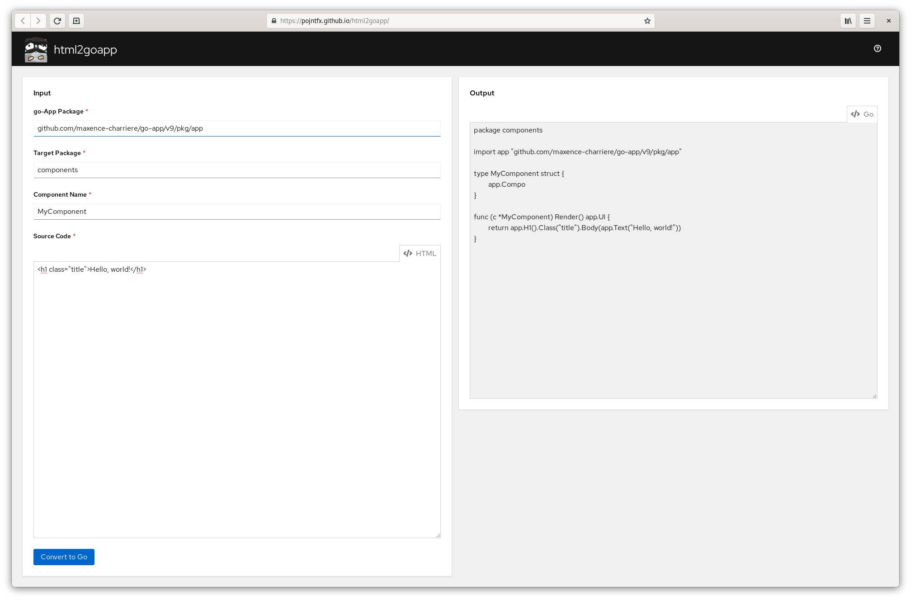
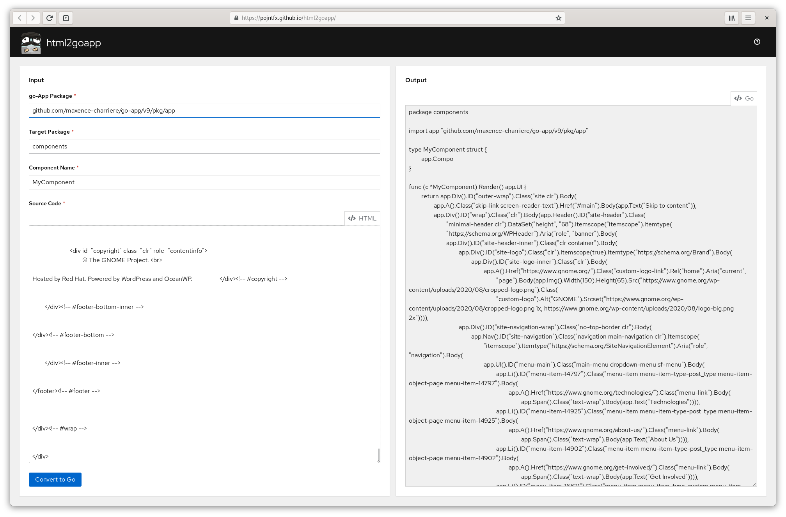

# HTML to go-app Converter


CLI and web app to convert HTML markup to [go-app.dev](https://go-app.dev/)'s syntax.

[](https://github.com/pojntfx/html2goapp/actions/workflows/hydrun.yaml)
[](https://pkg.go.dev/github.com/pojntfx/html2goapp)
[](https://matrix.to/#/#html2goapp:matrix.org?via=matrix.org)
[](https://github.com/pojntfx/html2goapp/releases)

## Installation

### CLI

Static binaries are also available on [GitHub releases](https://github.com/pojntfx/html2goapp/releases).

You can install them like so:

```shell
$ curl -L -o /tmp/html2goapp-cli https://github.com/pojntfx/html2goapp/releases/latest/download/html2goapp-cli.linux-$(uname -m)
$ sudo install /tmp/html2goapp-cli /usr/local/bin
```

### Web App

The frontend is also available on [GitHub releases](https://github.com/pojntfx/html2goapp/releases) in the form of a static `.tar.gz` archive; to deploy it, simply upload it to a CDN or copy it to a web server. For most users, this shouldn't be necessary though; thanks to [@maxence-charriere](https://github.com/maxence-charriere)'s [go-app package](https://go-app.dev/), html2goapp is a progressive web app. By simply visiting the [public deployment](https://pojntfx.github.io/html2goapp/) once, it will be available for offline use whenever you need it:

[](https://pojntfx.github.io/html2goapp/)

## Usage

### Web App

To convert HTML to go-app's syntax, simply paste the HTML you want to convert into the `Source Code` input and click on `Convert`. You may set the component name, go-app package import path and target package using the options.

### CLI

You can use the CLI to convert a HTML input file to go-app's syntax like so:

```shell
$ html2goapp-cli -component PF4Tabs -src example/index.html -pkg example > example/index.go
```

If you want to use the WebAssembly version of the CLI, use `go_js_wasm_exec`:

```shell
$ /usr/local/go/misc/wasm/go_js_wasm_exec out/cli/html2goapp-cli.js-wasm.wasm -component PF4Tabs -src example/index.html -pkg example > example/index.go
```

You can find the example [index.html](./example/index.html) and [index.go](./example/index.go) files in this repository.

## Screenshots

Click on an image to see a larger version.

<a display="inline" href="./assets/home.png?raw=true">

</a>

<a display="inline" href="./assets/complex.png?raw=true">

</a>

## Reference

### Command Line Arguments

```shell
$ html2goapp-cli --help
Usage of html2goapp-cli:
  -component string
        Name of the component to generate (default "MyComponent")
  -goAppPkg string
        Package to use for go-app (default "github.com/maxence-charriere/go-app/v9/pkg/app")
  -pkg string
        Package to generate component in (default "components")
  -src string
        HTML source file to convert (default "index.html")
```

## Acknowledgements

- This project would not have been possible were it not for [@maxence-charriere](https://github.com/maxence-charriere)'s [go-app package](https://go-app.dev/); if you enjoy using html2goapp, please donate to him!
- The open source [PatternFly design system](https://www.patternfly.org/v4/) provides the components for the project.
- [dave/jennifer](https://github.com/dave/jennifer) enables this project to generate the Go source code in a simple and declarative way.
- All the rest of the authors who worked on the dependencies used! Thanks a lot!

## Contributing

To contribute, please use the [GitHub flow](https://guides.github.com/introduction/flow/) and follow our [Code of Conduct](./CODE_OF_CONDUCT.md).

To build and start a development version of html2goapp locally, run the following:

```shell
$ git clone https://github.com/pojntfx/html2goapp.git
$ cd html2goapp
$ make run/pwa # To launch the web app
$ make run/cli # To launch the CLI
```

Have any questions or need help? Chat with us [on Matrix](https://matrix.to/#/#html2goapp:matrix.org?via=matrix.org)!

## Troubleshooting

- You get the `failed to execute 'compile' on 'webassembly': incorrect response mime type. expected 'application/wasm'.` error when trying to launch the web app? Please make sure that you have [added the WebAssembly MIME type](https://github.com/WebAssembly/spec/issues/573#issuecomment-824715263) on your webserver.
- Elements are missing in the generated output? Make sure you only have one root HTML element and do not include the `html`, `head` or `body` tags in your input.

## License

html2goapp (c) 2021 Felicitas Pojtinger and contributors

SPDX-License-Identifier: AGPL-3.0
